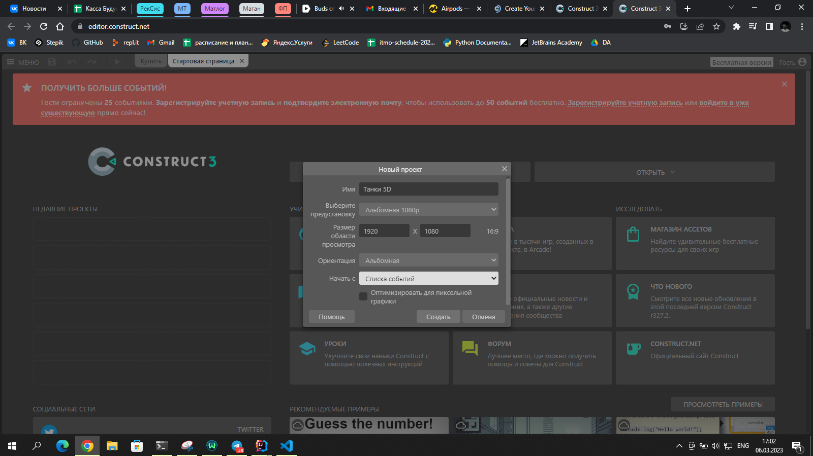
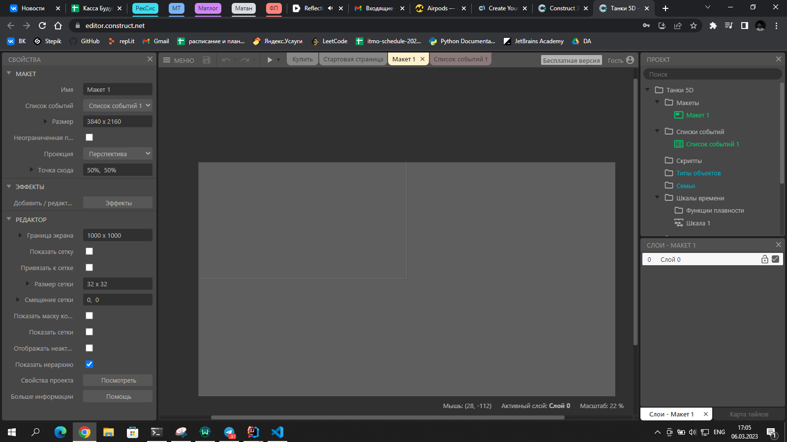
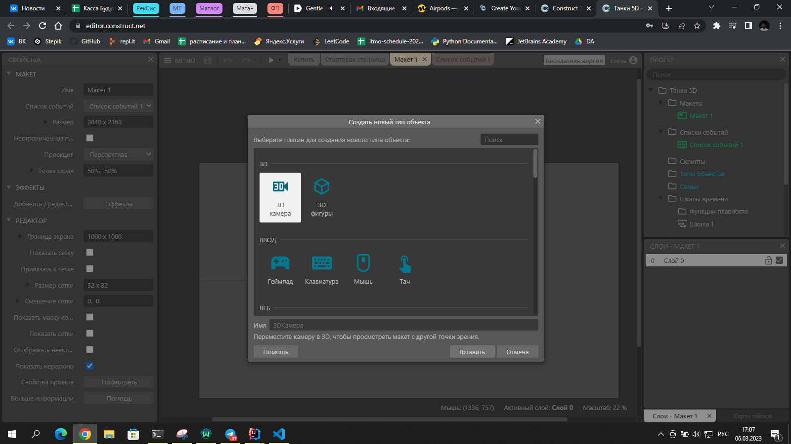
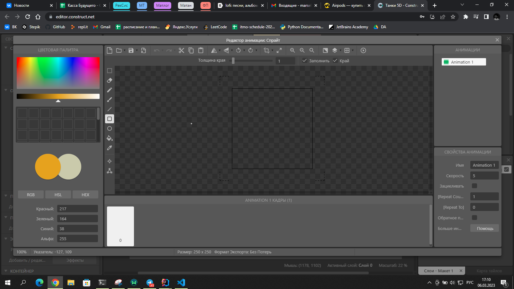
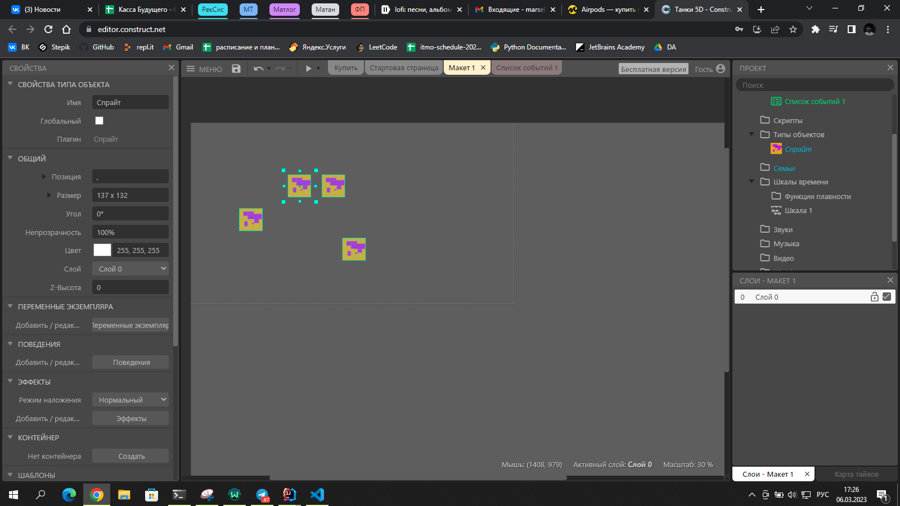
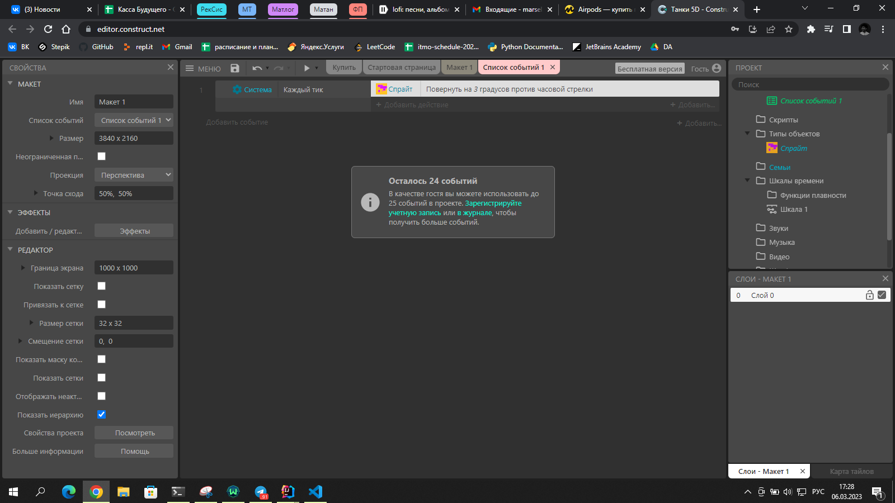
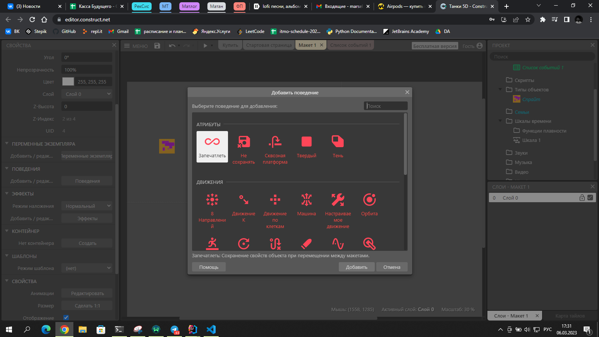

# Знакомство с Construct 3

## Содержание

- Что такое Construct 3
- Руководство по Construct 3

### Что такое Construct 3

Construct 3 - это бесплатный игровой движок, который позволяет создавать игры прямо в браузере для различных платформ, включая мобильные устройства, ПК, консоли и веб-сайты. 

### Руководство по Construct 3

### Где найти?

- [Официальный сайт](https://www.construct.net/)
- [Редактор Construct 3](https://editor.construct.net/)
- [Руководство для начинающих](https://editor.construct.net/?startTour) - можно пройти небольшое обучение, что я настоятельно рекомендую

### Использование

- При создании проекта будет открыто окно с настройками.

- Создался пустой проект. В левой части экрана находится панель с инструментами. В правой дерево объектов. В центре - рабочая область.

- В рабочей области можно создавать объекты, которые будут отображаться в игре. Для этого быстро нажмите на левую кнопку мыши два раза - выбере тип объекта. Далее настройте в редакторе.

## Окно редактирования спрайта

1. Сверху можно:
- открыть новое изображение
- охранить текущее изображение
- копировать/вставать
- отменить/вернуть изменения
- отразить/повернуть
- убрать лишние прозрачные пиксели
- изменить размер

2. Слева можно:
- выбрать инструмент
- выбрать цвет
- выбрать размер кисти
- выбрать размер ластика
- выбрать

3. Справа можно:
- выбрать слой
- выбрать прозрачность
- выбрать прозрачность слоя

4. В центре можно:
- рисовать

5. Снизу можно:
- выбирать подходящий спрайт
- создать анимацию

## Макет 

Макет - пространство игры, где можно размещать объекты. Все объекты будут отображаться в макете.

## Список событий

Список событий - это список всех событий, которые происходят в игре. Все события можно разделить на несколько категорий:
- События объектов из "поведения"
- События ваших объектов
- События системы

Написан код, который поворачивает объект на 3 градуса каждый тик.

## Поведения

Одно из самых важных мест в Construct 3. Все объекты имеют поведения. Поведения - это набор событий по умолчанию, которые происходят с объектом.  

Мы с вами постараемся разобраться во всех поведениях, чтобы вам было интереснее создавать игры.

### Популярные поведения

- Платформер - добавляет объекту возможность перемещаться по платформе

- Твердый - добавляет объекту возможность сталкиваться с другими объектами, запрещает проходить сквозь другие объекты

- 8 направлений - добавляет объекту возможность перемещаться в 8 направлений, по умолчанию управление стрелками

- Машинка - добавляет объекту возможность как машинка, управление стрелками

- Пуля - делает объект пулей, которая может двигаться в определенном направлении

- Движение К - добавляет объекту движение по кривой/прямой к какому либо объекту

## Практика

Необходимо самостоятельно создать игру-стрелялку в отдельном проекте. Можно пользоваться руководством, но это должно быть в отдельном проекте. 

По итогу у вас должен получиться такой проект:
- Есть игрок, он стреляет пулями и двигается в 8 направлениях
- Есть враги, которые спавнятся из определенного места и двигаются в направлении игрока
- При попадании пули в врага, враг умирает
- При касании игрока врагом, игрок погибиает - можно сразу же переродиться