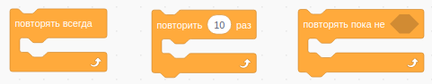

# Продолжаем изучение Scratch

## Цикл пока (while)

Повторяет блоки внутри себя, пока условие истинно.

## Задание 1
* В папке Animals найдите исполнителя horse (лошадка) и заставьте её бегать
вдоль границ экрана
* Попробуйте изменить скорость лошадки
* Попробуйте изменить направление движения лошадки
* Попробуйте изменить размер лошадки
* Попробуйте изменить вид лошадки
* Попробуйте изменить звук лошадки