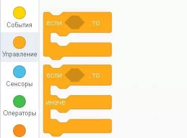
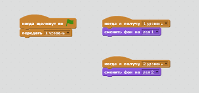
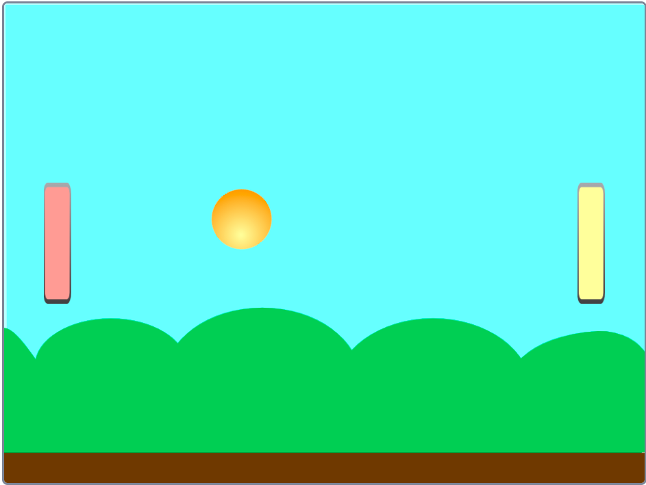
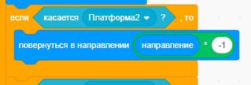

# Продолжаем изучение Scratch

## Цикл пока (while)

Повторяет блоки внутри себя, пока условие истинно.

## Условие (if)

Выполняет блоки внутри себя, если условие истинно.

## Передача/получение сообщений

Необходимо для общения между объектами.

## Задания в классе

### Задание 1

Сделать проигрыш при столкновении с врагом.

### Задание 2

При проигрыше сделать смену фона.

## Домашнее задание

### Задание 1 - пинг-понг на двоих

Сделать игру, в которой:

* Есть две платформы, которые можно двигать вверх-вниз.
    * Одна - управляется клавишами W и S.
    * Другая - управляется клавишами стрелками вверх и вниз.
* Есть мячик, который движется по полю.
* Если мячик коснулся платформы, то он отскакивает.
* Если мячик коснулся верхней или нижней границы поля, то он отскакивает.
* Если мячик коснулся левой или правой границы поля, то игра заканчивается.
* Когда игра заканчивается, появляется сообщение о том, кто выиграл и сменяется фон.

## Важные подсказки

* для отскоков от краев, нужно использовать блок `если касается края, оттолкнуться` в группе блоков `движение`.
* для проверки отскоков от платформы, нужно использовать блок `если .. то` в группе блоков `управление` и
  блок `касается [переменная]` в группе блоков `сенсоры`.
* для самого отскока используйте следующий пример:
  
* для смены фона используйте блок `сменить фон на [фон]` в группе блоков `внешний вид` и
  блоки `передать сообщение [сообщение]` и `когда я получу [сообщение]` в группе блоков `события`.