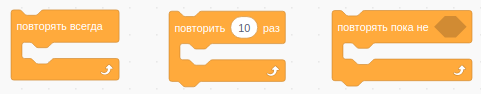
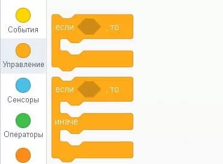
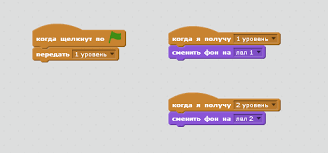
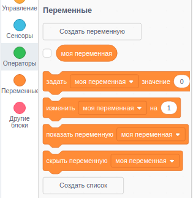
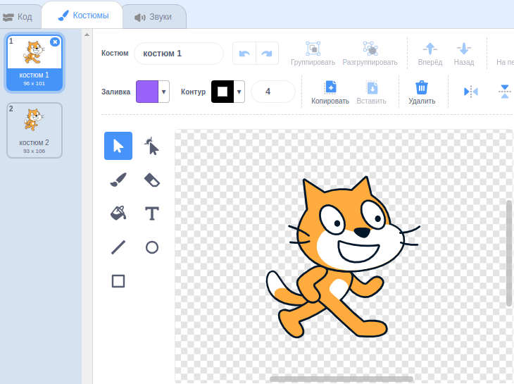
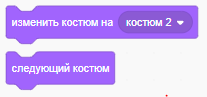
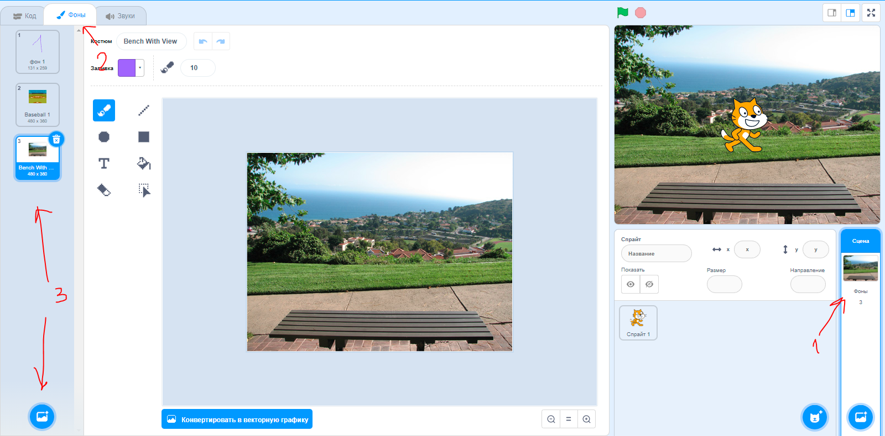
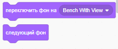

# Продолжаем изучать Scratch

## Повторение

### Цикл пока (while)

Повторяет блоки внутри себя, пока условие истинно.



### Условие (if)

Выполняет блоки внутри себя, если условие истинно.



### Передача/получение сообщений

Необходимо для общения между объектами.



## Переменные



Переменные - это именованные ячейки памяти, в которые можно записывать и читать значения.

Они нам нужны для хранения данных, которые мы будем использовать в программе.

Например, мы можем хранить в переменной количество очков, которые набрал игрок.

А что ещё можем хранить?

## Смена внешнего вида



Мы можем менять внешний вид объекта, меняя его костюм. 



## Смена фона



Мы можем менять фон сцены.




### Практические задания

1. Создайте объект, который будет менять свой внешний вид при нажатии на него.
2. Создайте объект, который будет менять фон сцены при нажатии на пробел.
   1. Теперь добавьте смены фона на предыдущий и следующий при нажатии на стрелки влево и вправо соответственно.
3. Создайте объект, при нажатии на который будут прибавляться очки в переменную.
   1. Теперь добавьте счётчик очков, который будет увеличиваться при нажатии на пробел.
   2. Теперь добавьте счётчик очков, который будет уменьшаться при нажатии на стрелку вниз.


### Создание игры "Ловля монет"

1. С неба будут падать монеты, которые нужно ловить.
2. Ловит монеты любой персонаж, которым можно управлять стрелками.
3. Если мы поймали монету, то нам начисляются очки и на секунду наш персонаж меняет костюм на счастливый.
4. Если мы пропустили монету, то нам снимаются очки.
5. После того как упала одна монета, появляется следующая.
6. Если мы набрали 10 очков, то мы выиграли. Нам об этом сообщают и игра заканчивается.

#### Подсказки

1. Создайте ```переменную```, в которой будет храниться количество очков - изначально она равна 0.
2. Для завершения игры лучше использовать ```сообщения```


## Домашнее задание:


