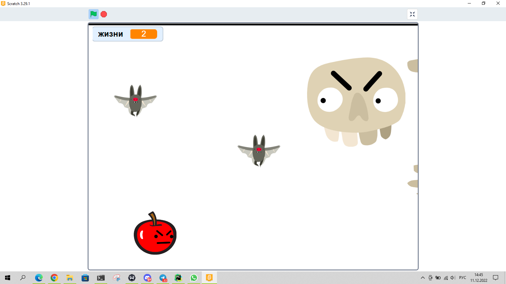

# Продолжаем работать со Scratch

## Проверка и разбор домашнего задания

### Создание игры "Ловля монет"

1. С неба будут падать монеты, которые нужно ловить.
2. Ловит монеты любой персонаж, которым можно управлять стрелками.
3. Если мы поймали монету, то нам начисляются очки и на секунду наш персонаж меняет костюм на счастливый.
4. Если мы пропустили монету, то нам снимаются очки.
5. После того как упала одна монета, появляется следующая.
6. Если мы набрали 10 очков, то мы выиграли. Нам об этом сообщают и игра заканчивается.

## Практика

### Создание игры "Достань игрушку"

1. На сцене есть игрушка, которую нужно достать.
2. Игрушка может быть в любом месте сцены.
3. Мы можем управлять автоматической рукой, которая может достать игрушку.
4. При нажатии на пробел рука должна достать игрушку.

