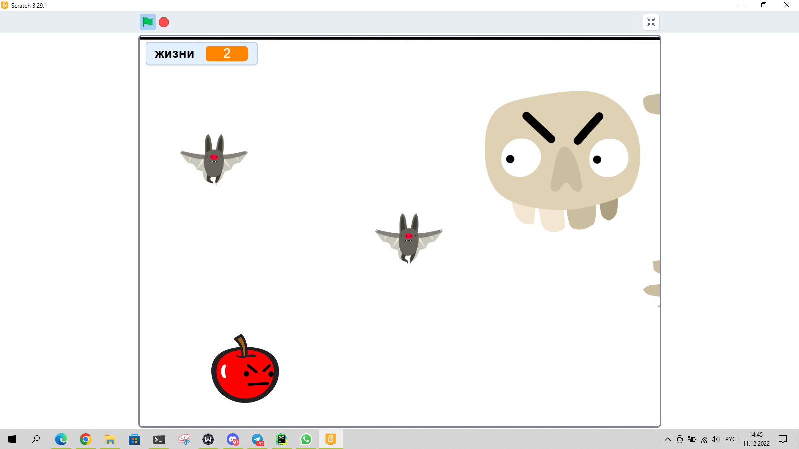

# Продолжаем работать со Scratch

## Проверка и разбор домашнего задания

### Создание игры "Ловля монет"

1. С неба будут падать монеты, которые нужно ловить.
2. Ловит монеты любой персонаж, которым можно управлять стрелками.
3. Если мы поймали монету, то нам начисляются очки и на секунду наш персонаж меняет костюм на счастливый.
4. Если мы пропустили монету, то нам снимаются очки.
5. После того как упала одна монета, появляется следующая.
6. Если мы набрали 10 очков, то мы выиграли. Нам об этом сообщают и игра заканчивается.

## Практика

### Создание игры "Бой с боссом I" - 1 балл, можно выполнить частично

1. На поле появляется босс, который двигается вверх-вниз.
2. На поле появляется персонаж, который мы управляем стрелками. 
3. У персонажа есть 10 жизней.
4. Босс стреляет в нас. Если пуля попадает в нас, то у нас снимается одна жизнь.
5. Если у нас закончились жизни, то мы проиграли. Нам об этом сообщают и игра заканчивается.
6. Нам нужно выстоять 20 секунд, чтобы выиграть. Нам об этом сообщают и игра заканчивается.

#### Бонус на 0.5 балла

1. После того как игра закончилась, у нас появляется кнопка "Начать заново" - используйте сообщения для этого.
2. Мы можем тоже стрелять в босса. Если пуля попадает в босса, то у него снимается одна жизнь.