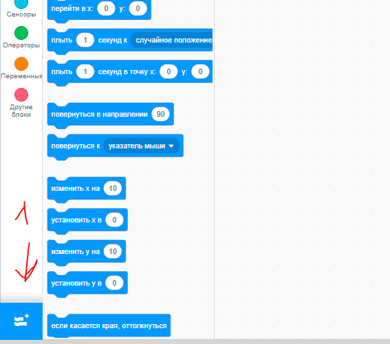
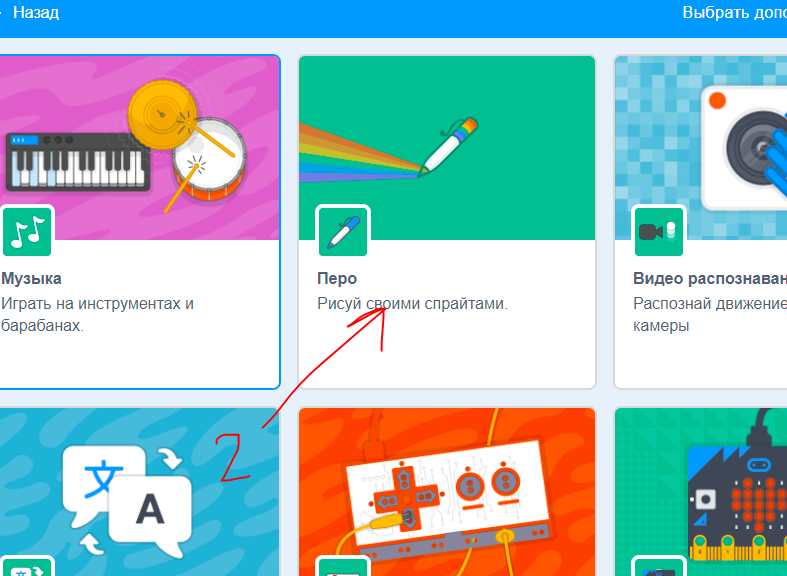
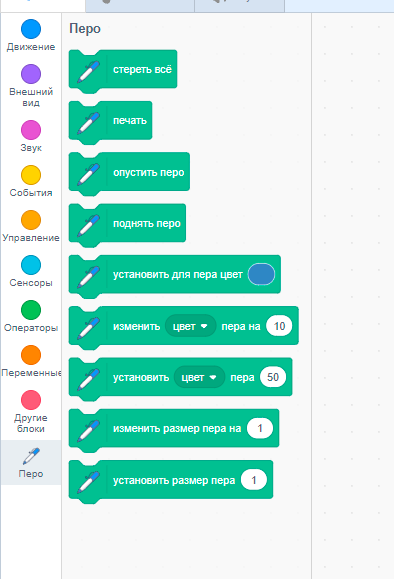
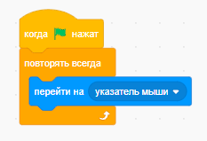
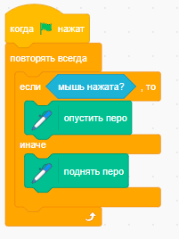
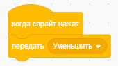
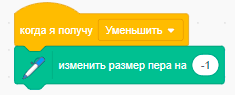

# Аналог Paint в Scratch

## Проверка и разбор домашнего задания

## Paint

### Задание

Создайте программу, аналог Paint. В программе должны быть реализованы следующие функции:

* Рисование кистью
* Выбор цвета кисти
* Выбор толщины кисти
* Выбор инструмента (кисть, ластик, заливка)

### Подсказки

#### Чтобы рисовать кистью, необходимо установить расширение `Перо`

#### Давайте посмотрим какие есть команды для пера

1. `Стереть всё` - очищает холст
2. `Печать` - рисует текущий спрайт на холсте (будто бы печатает его)
3. `Опустить перо` - опускает перо, чтобы рисовать
4. `Поднять перо` - поднимает перо, чтобы не рисовать
5. `Установить для пера цвет` - устанавливает цвет пера
6. `Изменить цвет пера на` - изменяет цвет пера на указанное значение
7. `Установить цвет пера на` - устанавливает цвет пера на указанное значение
8. `Изменить размер пера на` - изменяет размер пера на указанное значение
9. `Установить размер пера на` - устанавливает размер пера на указанное значение

### Помощь

Суть в том, что вы должны реализовать программу, которая будет рисовать кистью. Для этого вам необходимо установить
расширение `Перо` и использовать команды для рисования. При этом вы можете использовать любые блоки, которые вы знаете.

1. Сначала необходимо выбрать спрайт кисти - то есть то, чем будете рисовать.
2. После этого вы должны перемещаться за указателем мыши
   
3. После этого вы должны опускать перо, если мышь нажата, а иначе поднимать
   
4. Изменять размер можно, используя сообщения
   
   
5. Аналогично можно реализовать и остальные команды

## Работа в классе [скачать](Paint.sb3)

## Домашнее задание
1. Можно скачать то, что делали в классе или сделать её самому
2. Добавить 5 цветов
3. Добавить ластик, который стирает только то, куда наведешь кисть
4. Сделать печать нескольких разных объектов (с помощью блока `печать`)

