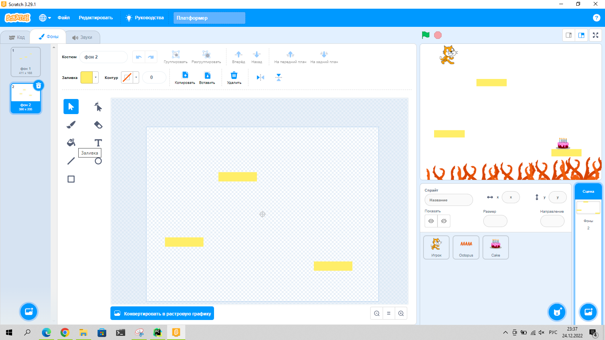

# Создание платформера

## Цель

Создать игру в жанре платформера.

## Полезное

Уровни мы делаем с помощью различных фонов.

## Задачи

* Реализовать движение персонажа по горизонтали
* Реализовать прыжок персонажа
* Добавить в игру несколько уровней, с различными препятствиями
* Реализовать смену уровней

Файл классной работы доступен по [Платформер](Платформер.sb3)

## Домашнее задание:

* Сделать 5-7 различных уровней
* Реализовать смену уровней
* Реализовать счетчик очков
* Реализовать счетчик жизней
* бонус на 0.5 балла - сделать кнопки с выбором уровней

