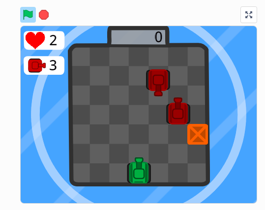

# Практика

Давайте откроем игру [Scratch](https://scratch.mit.edu/projects/770357682)

Для начала выучим что-то новое.

У нас есть блок `Другие блоки`:
- Можно создавать свой блок из нескольких действий
- Можно использовать такой 

## Задачи
- Реализовать движение танка по горизонтали и вертикали
- Реализовать повороты танка
- При нажатии на пробел танк должен стрелять
- Вражеские танки будут появляться в случайных местах
- Вражеские танки будут создаваться копиями.
