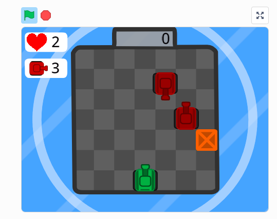
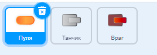
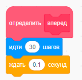
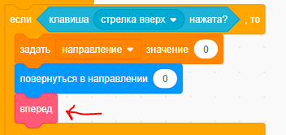
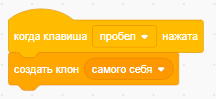
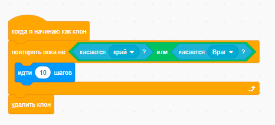
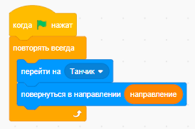
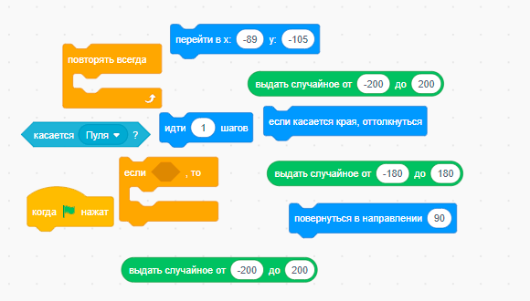
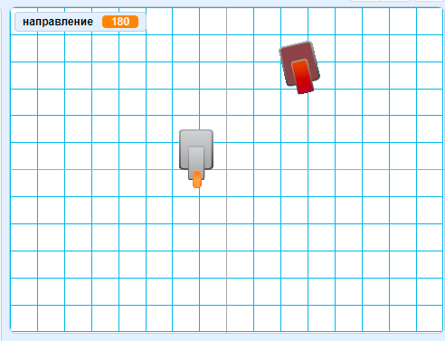

# Практика

Давайте откроем игру [Scratch](https://scratch.mit.edu/projects/770357682)

## Создание спрайтов

- Добавим спрайты танка, пули и врага

      

## Движение танка (код танка)

- Добавим движение танка вверх, вниз, влево, вправо 
    - Определим функцию движения
    
          

    - После её можно использовать в блоках
        
          

## Стрельба (код пули)

- Для стрельбы будем отслеживать нажатие клавиши пробела и создавать клона пули

    

- Нужно уметь отличать, когда пуля летит, а когда нет
- А летит она только тогда, когда является клоном, для этого будем использовать блок `когда я начинаю как клон`
- Наша пуля будет просто двигаться вперед, пока не столкнется с врагом или не выйдет за пределы экрана

      

- Но если оставить код так, то пуля будет всегда двигаться в одну сторону и из одной точки

- Для того, чтобы пуля двигалась в направлении танка, нужно добавить ей скрипт поворота и движении за танком

      

## Движение врага (код врага)

- Вам нужно будет реализовать движение врага
- Враг должен двигаться в случайном направлении
- Если враг столкнется с пулей, то он должен исчезнуть и появиться в другом месте
- Если враг столкнется со стеной, то он должен поменять направление движения

Это можно сделать, если правильно расставить блоки ниже

  

А вот итоговая картинка

  

## Дополнительные задания

- Добавить счетчик очков
- Добавить звуковые эффекты при стрельбе, попадании и уничтожении врага