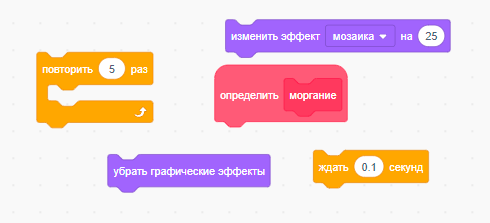
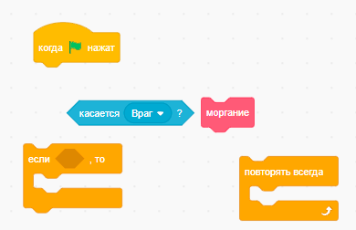
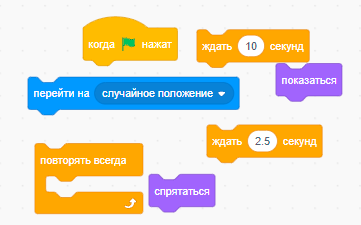
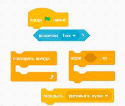
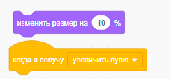
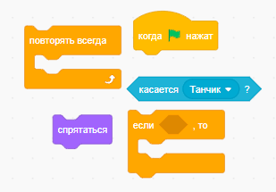
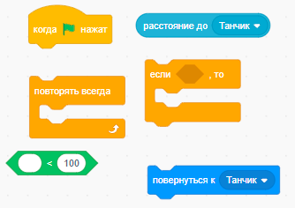

# Практика

Мы продолжим работать над проектом, который мы делали на прошлом [занятии](../7_Scratch_tank/README.md). Но теперь мы будем делать его вторую часть.

## Добавление "моргания" при столкновении с врагом

Когда танк сталкивается с врагом, наш танк должен мигать(можно сделать любую другую анимацию)

### Составьте код для мигания танка
  

Не забудьте добавить и сценарий для столкновения с врагом

  

### Перемещение врага при столкновении с танком

Когда танк сталкивается с врагом, враг должен переместиться в случайное место на сцене

У нас уже есть часть кода для этого(смотреть в коде для врага). 

Добавьте условия и для столкновения с танком. 

  

## Реализуйте жизни вашего танка (самостоятельно)

- Для этого добавим переменную жизней танка
- В месте условия для столкновения с врагом добавим уменьшение жизней танка
- Добавим постоянный код для проверки жизней танка. Если жизней меньше 0, то игра должна будет закончиться

 
 ## Добавим случайные падения бонусов(жизни, размер пуль)

- Скачайте спрайт [коробки](box.png) и добавьте его на сцену
- Добавим код для появления коробки на 2.5 секунды в случайном месте сцены через каждые 15 секунд
  

## Взаимодействие с коробкой

- Добавим код в танк для код касания коробки
- Сначала сделаем так, чтобы танк получал увеличение пуль при касании коробки
- Будем использовать `сообщения`

  

- Увеличить пулю можно с помощью блока `изменить размер на %`

  

- И не забудьте добавить исчезновение коробки после касания

  

## Добавим простой интеллект для врага

- Если он будет достаточно близко к нам, то он должен будет начать двигаться к нам
- Для этого добавим код для проверки расстояния между врагом и танком

  

## Домашннее задание
- Сделайте так, чтобы враг тоже мог получать бонусы за коробки и например увеличивать свой размер/скорость движения

- Добавьте аналогичную возможность проверки расстояния и для врага, чтобы он мог двигаться к коробке, если будет достаточно близко к ней