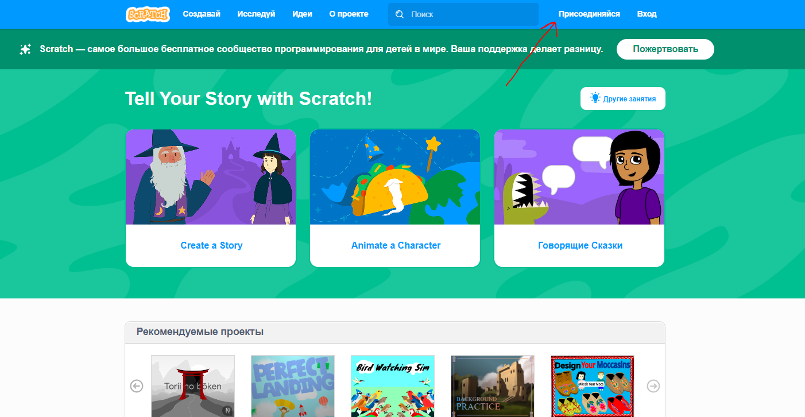
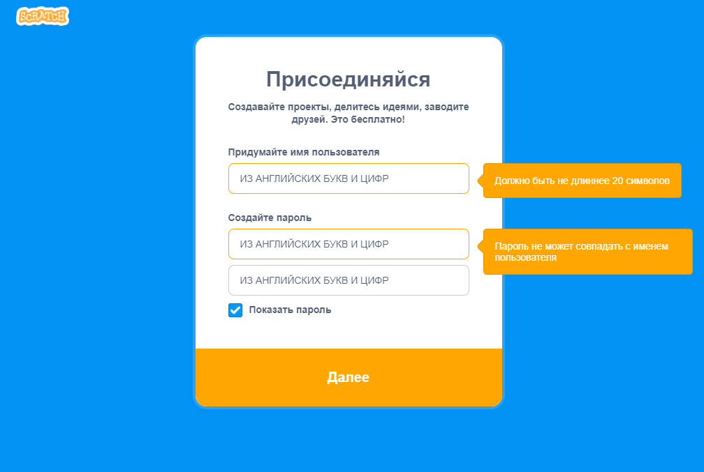
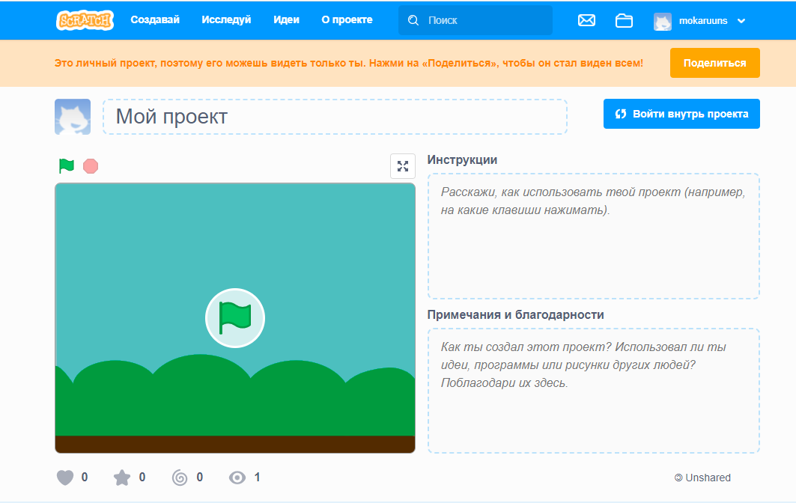
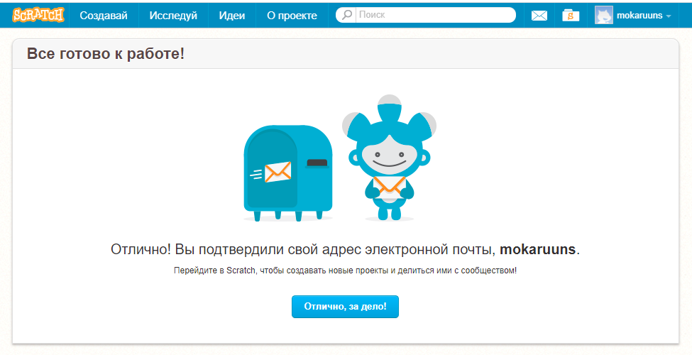
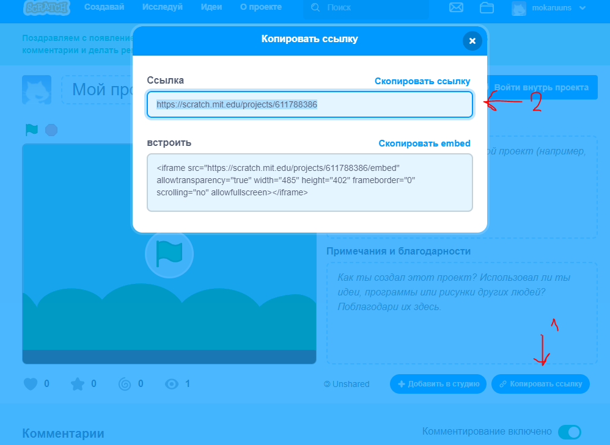

# Как загружать домашние задания

### 1. Зайдите на Scratch [scratch.mit.edu](https://scratch.mit.edu/) и зарегистрируйтесь

### 2. Зайдите под своим логином и паролем

### 3. Нажмите на кнопку "Создать проект"

### 4. Нажмите на кнопку "Загрузить проект с компьютера"
- Выберите файл с домашним заданием в месте, где вы его сохранили 
- Нажмите на кнопку "Загрузить"

### 5. Нажмите на кнопку "Сохранить"
- Посмотреть все свои проекты можно, если зайти в профиль и нажать на кнопку "Мои проекты"
- Или нажать на кнопку "Мои проекты" в правом верхнем углу (кнопка папка)

### 6. Нажмите на кнопку "Поделиться"
- Выберете проект в списке моих проектов
- Чтобы поделиться, нужно подтвердить свой email
- Если вы не подтвердите email, то ваши работы не будут видны другим пользователям

## 7. Отправить мне ссылку на ваш проект

